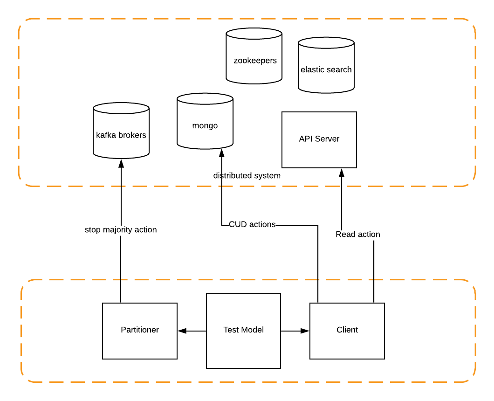

# Introduction Of Failure Test Framework
This project contains core of the failure test framework.

There are some other failure/chaos tools, but they mainly only responsible for injecting failure into system, user have to create other
tools and script to verify target system working as expected, moreover normally these 3rd tools require to install some agent on target
system, it is more like a intrusive solution, requires a lot of effort to work with other teams to make it up and running.

Instead Our failure test framework does not require to install any agent on your system, only inject failure via ssh command and linux builtin
tools, also system behavior verification during failure is integrated part of framework, you can just need to custimize your own system logic and
run the junit test, make it possible to run failure test as part of your regresion!


# How It Works
The concept of the framework is very simple, during runtime the framework will start several concurrent clients which send request to distributed system to
trigger business logic, at mean time there is one partitioner starting to inject failure in target server, at last framework will use FailModel define by user
to verify whether the action sequences comply with the model, e.g. CRUD consistentcy, persistentcy. Following diagram is a good example.



# Core Conecpt:

## Client:

Client is object used to send request or trigger business logic, normally there is one or multiple clients running during failure injection.

## Partitioner:

Partitioner is used to inject failure in system, there should be one partitioner, otherwise it is diffcult to trooubleshooting problems.

## Server:

Server Object is the abstraction of server node in test system.

To define your own Server, please exend ```Server``` class, and implement methods like ```kill```, ```start``` etc. so partitioner know how to operate on your server node.

## Action:

Action is the object to execute real actions, like trigger client logic, inject failures.

To implement your own action, extend ``` Action``` class,  and implement ```init, perform``` methods.


## Model:

Model is the driver of you failure test, different failure test for different system should have their own Model, in the Model, you need define your own ```validate``` method to vadiate test result,

## ModelVerificationHelper:

To make Model verification easier, there is a utility class ```ModelVerificationHelper```,  you can use it to retrieve test result for further verification, also you can show the timeline chart in browser.

## CommandExecutor:

CommandExecutor is used to execute command given by actions, to inject failure, we may execute some remote command on target server,
there are builtin implementation ```SshExecutor```  implementation which can execute ssh command on server, so make sure you put your ssh key file somewhere can be found.

# Test Example:
```java
    @Before
    public void setUp() {
        testContext = new TestContext("org.failuretest.failure.example");
        ServerLoader serverLoader = new ConfigFileServerLoader("node.json", testContext);
        testContext.setServerLoader(serverLoader);
    }

    @Test
    public void killESOnce() {
        ClientBuilder clientBuilder = new ClientBuilder(testContext);
        clientBuilder
                .actionType(ActionType.REPEAT)
                .concurrency(10)
                .duration(30)
                .action(new WriteAction())
                .action(new WaitAction(1))
                .build();
        PartitionerBuilder partitionerBuilder = new PartitionerBuilder(testContext);
        partitionerBuilder
                .target(ElasticServer.class)
                .partitionType(PartitionType.RANDOM)
                .actionType(ActionType.ONCE)
                .action(new WaitAction(5))
                .action(new KillAction())
                .action(new WaitAction(30))
                .action(new StartAction())
                .build();
        FailModel model = new LocalDockerModel(testContext, clientBuilder, partitionerBuilder);
        model.run();
        ModelVerificationHelper.showTimeLine();
        model.validate();
```
# Build Info:

```xml
        <dependency>
            <groupId>org.failuretest.qa</groupId>
            <artifactId>failure-test-core</artifactId>
            <version>1.3.0</version>
        </dependency>
```

Enjoy!


